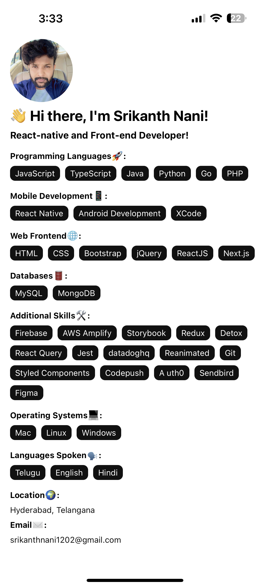

<figure>
  
</figure>
<details>
<summary>Click to show code</summary>

```javascript
import React from 'react';
import { View, Text, ScrollView, StyleSheet, Image, StatusBar } from 'react-native';

const person = {
  name: 'Srikanth Nani',
  avatar: 'https://avatars.githubusercontent.com/u/55689131?v=4',
  role: 'React-native and Front-end Developer',
  location: 'Hyderabad, Telangana',
  languagesSpoken: ['Telugu', 'English', 'Hindi'],
  contactEmail: 'srikanthnani1202@gmail.com',
  skills: {
    programmingLanguages: ['JavaScript', 'TypeScript', 'Java', 'Python', 'Go', 'PHP'],
    webFrontEnd: ['HTML', 'CSS', 'Bootstrap', 'jQuery', 'ReactJS', 'Next.js'],
    mobile: ['React Native', 'Android Development', 'XCode'],
    databases: ['MySQL', 'MongoDB'],
    additionalSkills: [
      'Firebase', 'AWS Amplify', 'Storybook', 'Redux', 'Detox', 'React Query', 'Jest', 'datadoghq',
      'Reanimated', 'Git', 'Styled Components', 'Codepush', 'A uth0', 'Sendbird', 'Figma',
    ],
  },
  operatingSystems: ['Mac', 'Linux', 'Windows'],
};

const renderItem = (title, content) => (
  <View style={styles.section}>
    <Text style={styles.sectionHeader}>{title}:</Text>
    {Array.isArray(content) ? (
      content.map((item) => (
        <View key={item} style={styles.skillContainer}>
          <Text style={styles.skillText}>{item}</Text>
        </View>
      ))
    ) : (
      <Text style={[styles.skillText, { color: '#111' }]}>{content}</Text>
    )}
  </View>
);

const App = () => (
  <ScrollView style={styles.container}>
    <StatusBar barStyle="dark-content" />
    <Image source={{ uri: person.avatar }} style={styles.avatar} />
    <Text style={styles.header}>👋 Hi there, I'm {person.name}!</Text>
    <Text style={styles.caption}>👨‍💻{person.role}!</Text>
    {renderItem('Programming Languages🚀', person.skills.programmingLanguages)}
    {renderItem('Mobile Development📱', person.skills.mobile)}
    {renderItem('Web Frontend🌐', person.skills.webFrontEnd)}
    {renderItem('Databases🛢️', person.skills.databases)}
    {renderItem('Additional Skills🛠️', person.skills.additionalSkills)}
    {renderItem('Operating Systems💻', person.operatingSystems)}
    {renderItem('Languages Spoken🗣️', person.languagesSpoken)}
    {renderItem('Location🌍', person.location)}
    {renderItem('Email✉️', person.contactEmail)}
  </ScrollView>
);

const styles = StyleSheet.create({
  container: {
    flex: 1,
    backgroundColor: '#fff',
    padding: 16,
    paddingVertical: 62,
  },
  header: {
    fontSize: 24,
    fontWeight: 'bold',
    marginBottom: 8,
  },
  avatar: {
    width: 100,
    height: 100,
    borderRadius: 50,
    marginBottom: 8,
  },
  section: {
    marginBottom: 8,
  },
  sectionHeader: {
    fontSize: 14,
    fontWeight: 'bold',
    marginBottom: 8,
  },
  skillContainer: {
    flexDirection: 'row',
    flexWrap: 'wrap',
  },
  skillItem: {
    marginRight: 8,
    marginBottom: 8,
    backgroundColor: '#111',
    borderRadius: 8,
    paddingVertical: 4,
    paddingHorizontal: 8,
    flexDirection: 'row',
    alignItems: 'center',
  },
  skillText: {
    color: 'white',
    fontSize: 14,
  },
  caption: {
    fontSize: 16,
    fontWeight: 'bold',
    marginBottom: 16,
  },
});

export default App;
```
